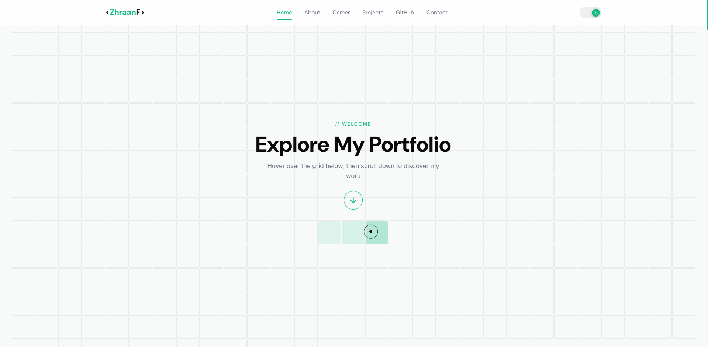

  
    
  <h2>ZhraanF | Portofolio Website</h2>
   
  

    
    
    
    
  

 

An exceptionally crafted, modern personal portfolio website built on the **Laravel Framework**. Engineered with a sharp focus on interactive UX, this project integrates premium layout elements, glassmorphism aesthetics, advanced GSAP scrolling animations, and an intelligent Lightbox presentation gallery.

## ✨ Key Features

- **Dynamic Interactive UI:** A beautifully customized mouse cursor (dot, ring, trail) that seamlessly interacts with UI components via dynamic CSS classes for robust contrast checks against dark modalities like lightboxes.
- **Glassmorphism Aesthetic:** Modern, sophisticated translucent panels across navigation, cards, and modal elements.
- **GSAP Animation Engine:** Scroll triggers, smooth beam reveals, and timeline fade-ins handled professionally by GreenSock Animation Platform.
- **Career & Activity Lightbox:** An integrated full-screen media lightbox allowing users to zoom into activity and career photos. Features keyboard navigational support (`Arrow Left / Right`, `Esc`), auto-fallback placeholders, and overlay grid badges for image groupings out-of-the-box.
- **Dark/Light Mode Ready:** Deeply structured CSS tokens allowing effortless toggling between themes globally.
- **Admin Dashboard:** A responsive underlying administration panel (`/admin`) capable of manipulating portfolio arrays, stats, skills, and basic configurations directly to the database.

## 🛠️ Technology Stack

- **Backend:** Laravel (PHP)
- **Frontend / Views:** HTML5, Laravel Blade
- **Styling:** Vanilla CSS3 (Robust Custom Design System, Flex/Grid architecture)
- **Animations / Scripts:** ES6 Javascript, GSAP (GreenSock)
- **Asset Bundler:** Vite
- **Database:** Relational schema accessed through Eloquent ORMs (MySQL / SQLite).

## 🏛️ Architecture & Content Flow

This project adopts a clean, monolithic MVC approach optimized for speed and dynamic content injection:

- **Interactive Layers:** GSAP and custom vanilla JS control DOM states without relying on heavy frontend frameworks, keeping the bundle incredibly lightweight.
- **Dynamic Seeding:** All text, achievements, and gallery data are parsed from relational database tables (`profiles`, `career_entries`, `activities`), avoiding hardcoded static displays.
- **Theming:** A global `data-theme` attribute on the root tag manipulates native CSS variables to instantly switch between dark (`#0A0A0A`) and light variants.

## 📖 Directory Structure Highlights

- **`resources/css/app.css` & `admin.css`:** Core styling hubs. Pure separation between front-end aesthetics and backend CMS styling.
- **`resources/js/app.js`:** The brain of the application's UX. Houses cursor initializations, GSAP ScrollTriggers, layout stat-counter logic, and the Lightbox API handlers.
- **`resources/views/pages/home.blade.php`:** The main focal page of the user-facing application encompassing all layout sections.
- **`app/Models/*`**: Example representations of backend data linking out to the interactive front-end Modals (e.g., `CareerEntry`, `Activity`, `Profile`).

## 👤 Author

**Zhraan** — _Data Enthusiast & Cybersecurity Learner_

---

_A personal portfolio documenting my professional journey, experimental projects, and continuous learning._
